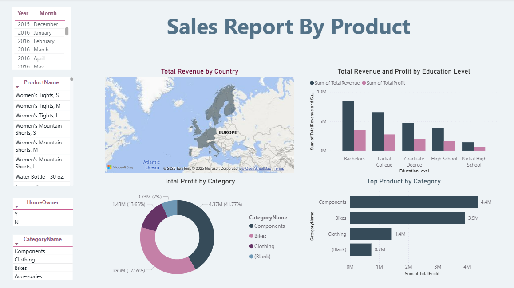

# ETL-On-Azure
This is a data engineering ETL project on Azure. We will utilize 5 services on Azure to build this ETL pipeline, from raw .csv files to eventually loading the prepared tables into Power BI.

1. Azure Data Factory - serves as pipeline orchestrator that when executed, will trigger the ETL process
2. Azure Blob Storage - here we will create 3 containers, one for raw data (bronze), one for processed data (silver), and one for final data (gold).
3. Azure Databricks - here we will create a workspace and a cluster to run our Transformations process, then dump the prepared data into intermediate container (silver).
4. Azure Synapse Analytics - this is for writing SQL scripts to Load the data into the final container (gold).
5. Power BI - this is for visualizing the data.

## Prerequisites
1. Azure Account
2. Azure Data Factory
3. Azure Blob Storage
4. Azure Databricks
5. Azure Synapse Analytics
6. Power BI
** Before running the pipeline, make sure to create a service principal and assign it the necessary permissions. **

## Data Source
A Github repository containing the raw .csv files.
Here you can refer to step-by-step guide: https://medium.com/@ashima.adya/build-a-complete-azure-data-pipeline-using-adf-databricks-synapse-power-bi-step-by-step-guide-43c745511682

## Power BI
From connecting to Azure Synapse Analytics, I built a dashboard using the tables created from Databricks notebook and retrieve from tables created in Synapse. Result looks like this:

